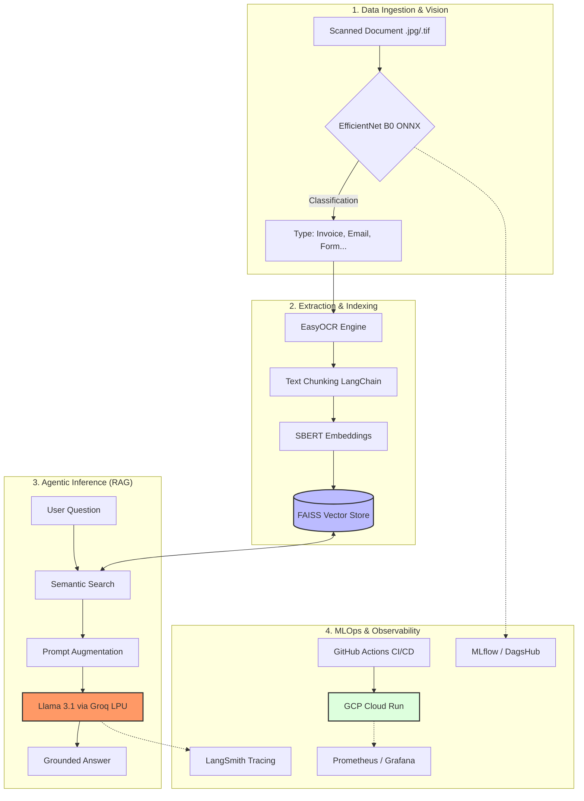

# 🚀 **IntelliDoc-Stream: Industrial-Grade Intelligent Document Processing (IDP)**
[](https://github.com/ngahyves/Intelligent-Document-Processing-engine/actions/workflows/ci.py.yml)


IntelliDoc-Stream is a production-ready AI pipeline that automates the classification, extraction, and semantic analysis of unstructured banking documents. By fusing **Computer Vision, State-of-the-Art OCR, and Generative AI (RAG)**, this system transforms raw scans (Invoices, Emails, Forms, Letters, Reports) into a searchable, auditable knowledge base with sub-second latency.

## 📊 Key Results & Engineering Impact

### 🏆 Model Performance
| Metric | Value |
|---|---|
| Document Classification Accuracy | 80% (5 classes · RVL-CDIP) |
| ONNX Inference Speedup vs PyTorch | 4.8x faster on CPU |
| ONNX Inference Latency | 187ms avg (50-images benchmark) |

### ⚡ Pipeline Latency (CPU · 50-images benchmark)
| Component | Latency |
|---|---|
| Vision — EfficientNet-B0 ONNX | 187ms avg |
| RAG Ingestion — SBERT + FAISS | 368ms avg |
| LLM Generation — Llama 3.1 via Groq | 640ms p50 · 1.21s p99 |
| OCR — EasyOCR CPU | 25.9s avg ⚠️ |
| **Pipeline excluding OCR** | **~555ms** |

> ⚠️ EasyOCR on CPU accounts for 97.9% of total latency.
> Production path: GPU deployment or Tesseract migration → target 1-3s end-to-end.

### 🔧 Engineering Highlights

- **Inference Optimization** — Converted EfficientNet-B0 from PyTorch
  to ONNX Runtime achieving 4.8x CPU speedup (187ms avg) —
  eliminating PyTorch dependency in production container

- **RAG Pipeline** — SBERT vectorization + FAISS semantic search
  + Llama 3.1 via Groq ; RAG ingestion in 368ms,
  LLM generation p50 640ms measured via LangSmith

- **Observability** — End-to-end tracing with LangSmith +
  Prometheus + Grafana for system metrics +
  MLflow for experiment tracking

- **RAG Guardrails** — responses grounded strictly in retrieved
  context ; prompt engineering enforces source-only generation

- **MLOps** — Prefect orchestration for batch ingestion pipeline,
  GitHub Actions CI/CD, deployed on GCP Cloud Run via Docker

- **Bottleneck Analysis** — EasyOCR CPU identified as constraint
  at 25.9s avg (97.9% of total) ; documented with production
  migration path in architecture notes
*   **Tech Stack:** 

***AI & Machine Learning***:`PyTorch` · `ONNX Runtime` · `Sentence-Transformers` · `Llama 3.1 (Groq)` · `RAG` · `FAISS` · `LangChain`

***⚙️ Backend & APIs***:`FastAPI` · `Pydantic` · `Uvicorn`

***🚀 MLOps & Orchestration***:`Docker` · `Prefect` · `MLflow` · `YAML configuration`

***📊 Monitoring & Observability***:`Prometheus` · `Grafana` · `LangSmith`

***☁️ Cloud & Deployment***:`Google Cloud Run` · `Groq Cloud` · `Linux/Bash`

***🧪 Testing & CI/CD***:`Pytest` · `GitHub Actions`



## 📂 Dataset: RVL-CDIP

This project uses a stratified subset of the **RVL-CDIP** (Ryerson Vision Lab Complex Document Information Processing) dataset. 

*   **Source**: [Kaggle - RVL-CDIP Subset](https://www.kaggle.com/datasets/pdavpoojan/the-rvlcdip-dataset-test)
*   **Nature**: Grayscale images of scanned documents from the 1980s-1990s.
*   **Scope**: For this IDP Engine, I focused on 5 key business categories:
    *   **Invoices**: Critical for accounts payable automation.
    *   **Forms**: Standard for data entry digitizing.
    *   **Letters & Emails**: For corporate communication routing.
    *   **Reports**: For high-level knowledge extraction.
*   **Pre-processing**: All images were resized to 224x224 and normalized using ImageNet statistics to match the EfficientNetB0 input requirements.

## 🏗️ **System Architecture**

The pipeline follows a modular microservice architecture designed for scalability and high availability:
* Vision Router: An EfficientNetB0 model (optimized via ONNX) identifies the document category.
* OCR Engine: Text extraction and spatial coordinate mapping using EasyOCR.
* Semantic Indexing: Intelligent chunking and vectorization using Sentence-BERT (all-MiniLM-L6-v2).
* Vector Store: High-performance similarity search powered by a FAISS index.
* Agentic Inference: Contextual Q&A using Llama 3.1 (8B) via Groq LPU for near-instant response times.

## 📊 **Observability & Experiment Tracking**

A core focus of this project is __Reliability and Auditability__, mandatory for the financial sector.
* LLM Tracing (LangSmith)

Every RAG query is traced to monitor the chain of thought, context retrieval quality, and token usage. This ensures the model remains grounded in the source documents and eliminates hallucinations.


An example of input and output of our LLM is just below


* Model Registry & Lineage (DagsHub/MLflow)

Experiment tracking is centralized on DagsHub. Every model version is linked to its training metrics (Accuracy=80%, Loss) and hyperparameters, but we saved the best model for the next parts of the project, ensuring 100% reproducibility.


* Infrastructure Monitoring (Prometheus & Grafana)
Real-time tracking of Golden Signals: Request Latency (P99)=0.99s, CPU/RAM utilization and number of requests


## 📋 **Project Lifecycle & Engineering Challenges**

* 1. Optimization for Production (ONNX, OCR)
To deploy on resource-constrained environments (8GB RAM), the PyTorch model was converted to ONNX.
***Result***: 4.8x reduction in inference latency. 
***Inference Bottlenecks:*** Identified OCR on CPU as the primary latency driver (97% of total time). Used this profiling to justify a future GPU-accelerated roadmap.
* 2. High-Performance RAG Ingestion
Implemented an automated ingestion flow using **Prefect** to handle batch document processing with built-in Retries and error handling.
***Idempotency***: The system checks for existing document hashes to prevent duplicate indexing in the vector store.
* 3. Software Rigor (CI/CD & Testing)
***Automated Testing***: 100% pass rate on Pytest suites covering API health, ONNX session integrity, and RAG retrieval logic.
***CI/CD:*** Fully automated deployment pipeline via GitHub Actions.
***Docker Optimization (3.5GB vs 10GB)***: Initially, the build context leaked local virtual environments and raw data. I used multi stage building, reducing the image size from 10GB to 3.5GB.

## 🚀 **Getting Started:**
**Local Development (Docker Compose)**
* Clone the repository:

```bash
git clone https://github.com/ngahyves/Intelligent-Document-Processing-engine
cd idp-engine
```
* Configure your credentials in .env:
```bash
GROQ_API_KEY=gsk_your_key
LANGCHAIN_API_KEY=lsv2_pt_your_key
```
* Spin up the full stack:
```bash
docker compose up --build
```
* API Usage

Ingest: POST /upload (Upload a scan)

Query: POST /ask (Ask a question about the document)

Health: GET /health (Status & Model info)

Swagger UI: Access at http://localhost:8000/docs

💡 **Key Lessons Learned**
* Decoupling Configuration: Solved circular import issues by separating logging logic from application settings.
* Dependency Synchronization: Managed "Dependency Hell" by strictly pinning versions to align Python 3.11 local environments with Docker Slim images.
* Inference Bottlenecks: Identified OCR on CPU as the primary latency driver and implemented profiling to justify future GPU scaling strategies.


**Yves-Bernard-Simplice NGAH - Machine Learning Engineer**
**Master’s in Biostatistics | Specialized in Robust & Explainable AI Systems**


## How to use this README effectively:
* Assets: Create an assets/ folder in your repo and put your screenshots there. The README will automatically display them.
* Links: Replace the placeholder links (your-username, your-repo) with your actual GitHub links.
* Interview Pitch: Use the "Key Lessons Learned" section as your script when they ask, "What was the hardest part of this project?"