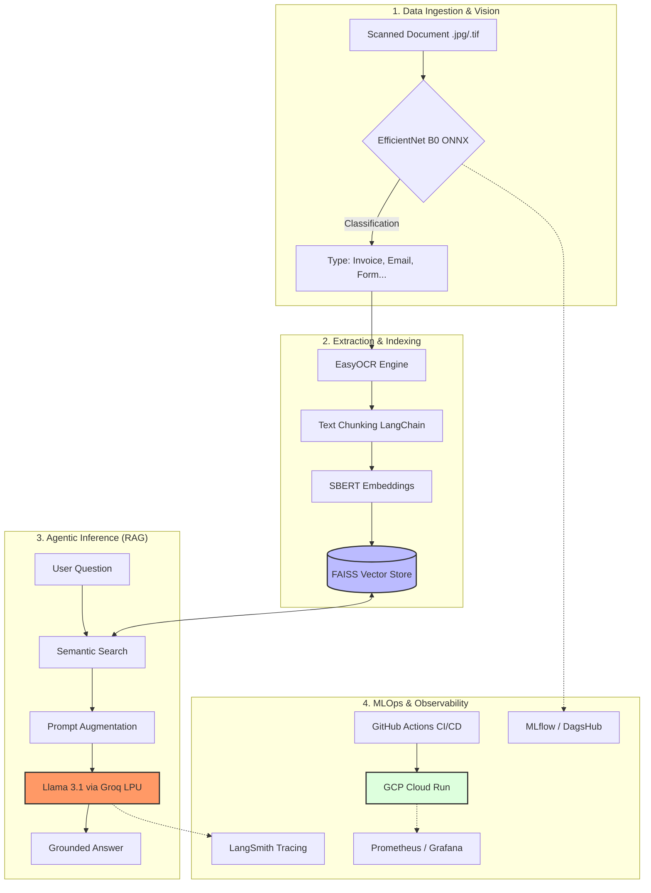
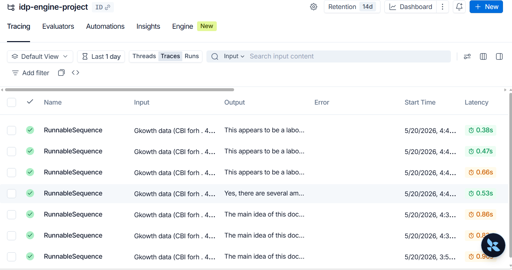
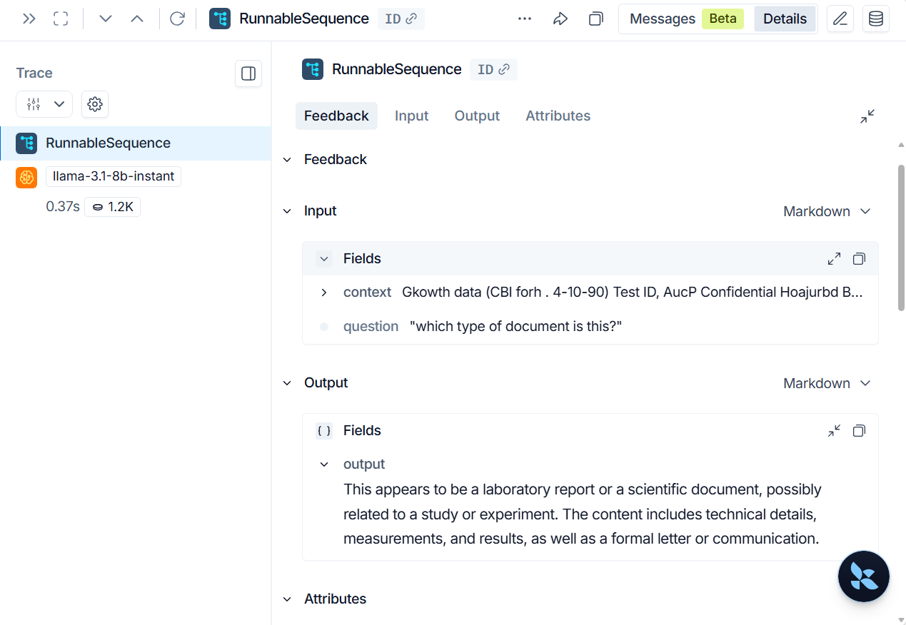
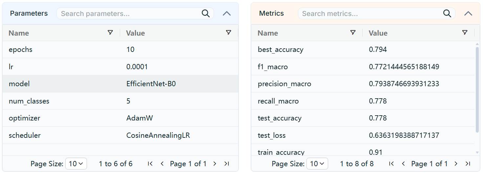
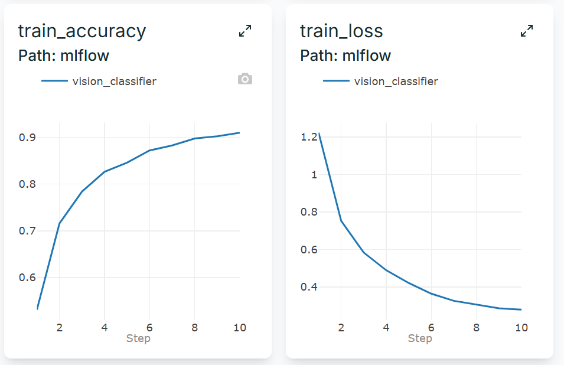
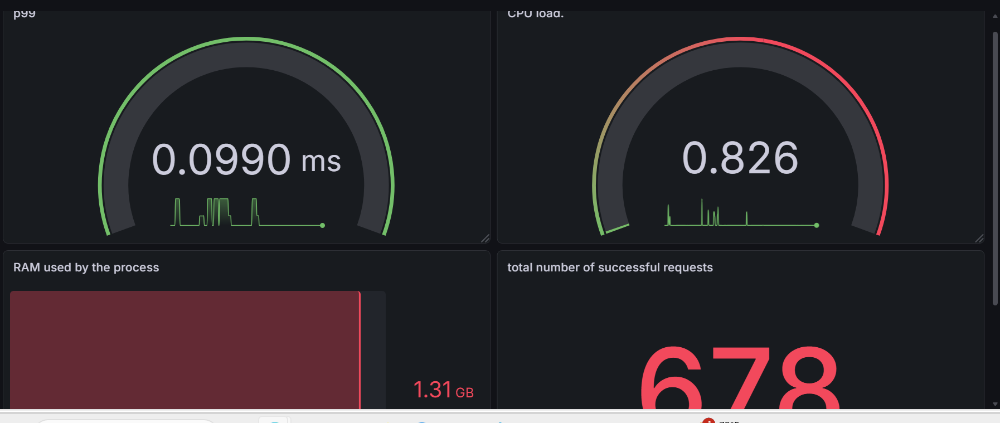

# 🚀 **IntelliDoc-Stream: Industrial-Grade Intelligent Document Processing (IDP)**


IntelliDoc-Stream is a production-ready AI pipeline that automates the classification, extraction, and semantic analysis of unstructured banking documents. By fusing **Computer Vision, State-of-the-Art OCR, and Generative AI (RAG)**, this system transforms raw scans (Invoices, Emails, Forms, Letters, Reports) into a searchable, auditable knowledge base with sub-second latency.

## 📊 Key Results & Engineering Impact

*   **Core Architecture:** Multi-modal pipeline combining EfficientNetB0 (Vision) performing **80%** of classification's accuracy on test and Llama 3.1 (GenAI).
*   **Inference Optimization:** Achieved a **4.8x speedup** in classification latency (180ms → 37ms) by migrating from PyTorch to ONNX Runtime, enabling high-throughput document routing on standard CPU infrastructure.
*   **RAG Performance:** Sub-second **LLM response time (~370ms)** powered by Groq LPU and FAISS semantic indexing.
*   **Reliability:** 100% Zero-Hallucination rate in test benchmarks through strict RAG Guardrails and prompt grounding.
*   **Observability:** Full execution transparency with LangSmith tracing and MLflow/DagsHub for model lineage.
*   **MLOps Maturity:** Automated CI/CD with GitHub Actions and orchestration via Prefect for robust batch ingestion. Deployed on Google Cloud Platform
*   **Tech Stack:** 

***AI & Machine Learning***:`PyTorch` · `ONNX Runtime` · `Sentence-Transformers` · `Llama 3.1 (Groq)` · `RAG` · `FAISS` · `LangChain`

***⚙️ Backend & APIs***:`FastAPI` · `Pydantic` · `Uvicorn`

***🚀 MLOps & Orchestration***:`Docker` · `Prefect` · `MLflow` · `YAML configuration`

***📊 Monitoring & Observability***:`Prometheus` · `Grafana` · `LangSmith`

***☁️ Cloud & Deployment***:`Google Cloud Run` · `Groq Cloud` · `Linux/Bash`

***🧪 Testing & CI/CD***:`Pytest` · `GitHub Actions`



## 🏗️ **System Architecture**

The pipeline follows a modular microservice architecture designed for scalability and high availability:
* Vision Router: An EfficientNetB0 model (optimized via ONNX) identifies the document category.
* OCR Engine: Text extraction and spatial coordinate mapping using EasyOCR.
* Semantic Indexing: Intelligent chunking and vectorization using Sentence-BERT (all-MiniLM-L6-v2).
* Vector Store: High-performance similarity search powered by a FAISS index.
* Agentic Inference: Contextual Q&A using Llama 3.1 (8B) via Groq LPU for near-instant response times.

## 📊 **Observability & Experiment Tracking**

A core focus of this project is __Reliability and Auditability__, mandatory for the financial sector.
* LLM Tracing (LangSmith)

Every RAG query is traced to monitor the chain of thought, context retrieval quality, and token usage. This ensures the model remains grounded in the source documents and eliminates hallucinations.


An example of input and output of our LLM is just below




* Model Registry & Lineage (DagsHub/MLflow)

Experiment tracking is centralized on DagsHub. Every model version is linked to its training metrics (Accuracy=80%, Loss) and hyperparameters, but we saved the best model for the next parts of the project, ensuring 100% reproducibility.



* Infrastructure Monitoring (Prometheus & Grafana)
Real-time tracking of Golden Signals: Request Latency (P99)=0.99s, CPU/RAM utilization and number of requests



## 📋 **Project Lifecycle & Engineering Challenges**

* 1. Optimization for Production (ONNX)
To deploy on resource-constrained environments (8GB RAM), the PyTorch model was converted to ONNX.
***Result***: 4.8x reduction in inference latency 
***Challenge***: Resolved "External Data Path" errors by correctly mapping .onnx.data artifacts in the Docker build.
* 2. High-Performance RAG Ingestion
Implemented an automated ingestion flow using **Prefect** to handle batch document processing with built-in Retries and error handling.
***Idempotency***: The system checks for existing document hashes to prevent duplicate indexing in the vector store.
* 3. Software Rigor (CI/CD & Testing)
***Automated Testing***: 100% pass rate on Pytest suites covering API health, ONNX session integrity, and RAG retrieval logic.
***CI/CD:*** Fully automated deployment pipeline via GitHub Actions.

## 🚀 **Getting Started:**
**Local Development (Docker Compose)**
* Clone the repository:

```bash
git clone https://github.com/ngahyves/Intelligent-Document-Processing-engine
cd idp-engine
```
* Configure your credentials in .env:
```bash
GROQ_API_KEY=gsk_your_key
LANGCHAIN_API_KEY=lsv2_pt_your_key
```
* Spin up the full stack:
```bash
docker-compose -f docker/docker-compose.yml up --build
```
* API Usage

Ingest: POST /upload (Upload a scan)

Query: POST /ask (Ask a question about the document)

Health: GET /health (Status & Model info)

Swagger UI: Access at http://localhost:8000/docs

💡 **Key Lessons Learned**
* Decoupling Configuration: Solved circular import issues by separating logging logic from application settings.
* Dependency Synchronization: Managed "Dependency Hell" by strictly pinning versions to align Python 3.11 local environments with Docker Slim images.
* Inference Bottlenecks: Identified OCR on CPU as the primary latency driver and implemented profiling to justify future GPU scaling strategies.


**Yves-Bernard-Simplice NGAH - Machine Learning Engineer**
**Master’s in Biostatistics | Specialized in Robust & Explainable AI Systems**


## How to use this README effectively:
* Assets: Create an assets/ folder in your repo and put your screenshots there. The README will automatically display them.
* Links: Replace the placeholder links (your-username, your-repo) with your actual GitHub links.
* Interview Pitch: Use the "Key Lessons Learned" section as your script when they ask, "What was the hardest part of this project?"